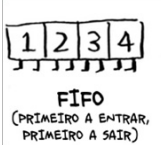
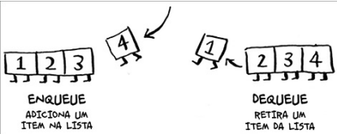

## Técnica de paginação

Para ocultar a organização complexa da memória física e a alocação de memória para os processos computacionais é implementada a noção de **memória virtual**. A memória virtual está dividida em dois tipos de endereços:

    **1-Físicos ou reais:** os endereços comumente conhecidos endereços de bytes de memória física;
    **2-Lógicos ou virtuais:** são os endereços gerados pelo computador em tempo de execução.

Para que seja possível acessar a memória através dos endereços lógicos, a **MMU**(Unidade de Gerência de Memória) traduz os endereços lógicos para físicos. Com a tradução concluida, o acesso pelo processador agora é permitido, desde que não ocorra nenhum erro de acesso indevido.

Com os benefícios da implementação da memória virtual, temos algumas técnicas são usadas para que haja a implementação da memória virtual.Uma delas é a técnica de *paginação*.

A técnica de paginação divide a memória fisíca e virtual em blocos fixos, denomidados: 
**Páginas**(*page*) -blocos da memória virtual 
**Quadros/Molduras** (*frame*) -blocos da memória fisíca onde as páginas são carregadas.

* Quando o processo é executado o espaço de endereçamento virtual é dividido em páginas;
* As páginas são mapeadas nos quadros(frame);
* A MMU traduz os endereços lógicos em físicos, caso a pagina requisitada, por meio do endereço, já se encontra mapeada no quadro, o processo pode acessa-la sem problema. Caso contrário, ocorre uma falha.
* Quando ocorre um falha, ou seja a página necessária não se encontra carregada em memória física, o sistema operacional interrompe a execução e carrega a página em um quadro (frame) disponível. Caso não houver um quadro disponível é necessário aplicar um *algoritmo de substituição*. 

Os algoritmos de substituição de páginas são: Algoritmo ótimo, Algoritmo de substituição de páginas não 
usadas recentemente (*NRU*), Algoritmo de substituição de páginas segunda chance, Algoritmo de substituição de páginas do 
relógio, Algoritmo de substituição de páginas 
usadas menos recentemente (*LRU*), Algoritmo de substituição de páginas do 
conjunto de trabalho e **Algoritmo de substituição de páginas 
primeiro a entrar, primeiro a sair (*FIFO*)** que será implementado para resolver o problema de paginação.

O algoritmo de paginação o primeiro a entrar, primeiro a sair (*first in, first out*
— FIFO)

Para ilustrar o seu funcionamento, vamos imaginar -em um mundo ideal- que você e um amigo estão em uma fila em uma parada de ônibus. Se você está antes dele na fila, entrará primeiro no ônibus, seu amigo depois e esse cenário se repetirá para o restante da fila.

Esse funcionamento é chamado de fila e essa estrutura permite que duas operações sejam realizadas: 
enfileirar(*enqueue*) e desenfileirar(*dequeue*).

Entendido o que é fila, vamos entender o código da tÉcnica de paginação utilizando a algoritmo FIFO na linguagem de programação C

**Especificações do problema:**

* A memória tem um número fixo de molduras (*frames*).

* O programa recebe como entrada uma sequência de números de páginas e o
número de molduras disponíveis.

* O objetivo é contar o número de falhas de página que ocorrem ao longo da
execução e exibir quais páginas estão na memória a cada substituição.
Regras:
1. A cada nova página solicitada, se ela já estiver na memória, nada acontece.
2. Se a página solicitada não estiver na memória:
○ Caso haja espaço livre, a página é inserida.
○ Caso não haja espaço livre, a página mais antiga (que está há mais tempo
na memória) é removida e a nova página é inserida em seu lugar.

3. O programa deve contar quantas falhas de página ocorreram durante a execução.

Entrada:
*  Sequência de páginas: Uma lista de números que representam as páginas que
estão sendo solicitadas pelo processo.
* Número de molduras: Um número inteiro que indica quantos espaços de memória
o sistema tem disponíveis.
Saída:
* Exibir o estado da memória (as páginas presentes) após cada falha de página.
* Exibir o número total de falhas de página.

#### Funçoes e procedimentos criados:

Temos duas funções e um procedimento que irão fazer que o nosso algoritmo funcione:
**bool estaNaMemoria()**: para que seja possível usar o tipo booleano em C importamos a biblioteca *#include <stdbool.h>*. Esta função verifica se a página já está na memória, caso seja esteja ela retorna *true*, caso contrário *false*;

**void imprimeMemoria()**: este procedimento é responsável por imprimir na tela do usuário qual o estado da memória, ou seja, verifica se o número já foi carregado na memória

**void paginaFifo**: já este procedimento irá simular a nossa fila. Ele irá inicializar os quadros(*frame*) com o valor -1, indicando que estão vazios. Logo em seguido a função estaNaMemoria() é invocada e retorna *true* ou *false*. Caso seja true a mensagem de falha não é exibida, agora se o resultado for false a mensagem de falha é exibida na tela do usuário.

**Referências bibliográficas**
MAZIERO, C. A. Sistemas Operacionais: Conceitos e Mecanismos. 2013.
DEITEL, H. M.; et al. Sistemas Operacionais. Prentice-Hall, 3a edição, 2005.
TANENBAUM, A. S. Sistemas Operacionais Modernos. Prentice-Hall, 2a
edição, 2003.
BHARGAVA, Y. Aditya. Entendendo algoritmos: Um guia ilustrado para programadores e outros curiosos.2017
